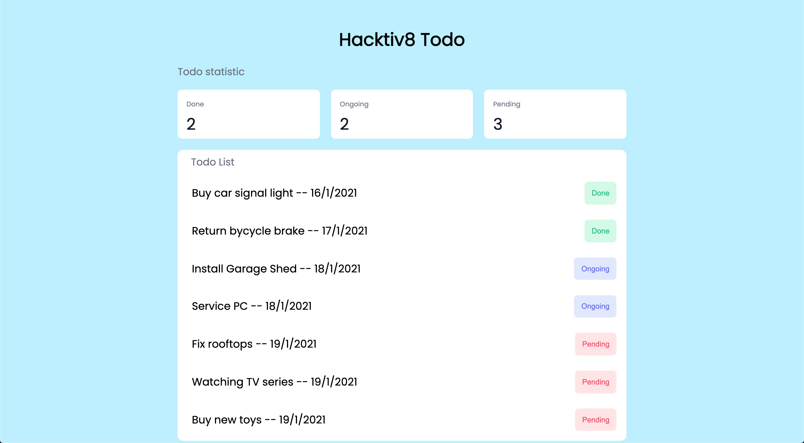

# TODO LIST

### NOTES

- Jalankan `npm install` terlebih dahulu
- Pada skeleton terdapat folder `__tests__`, folder ini beserta file-file di dalamnya tidak boleh diubah sama sekali.
- untuk menjalankan test untuk memastikan solusi kamu sudah benar, jalankan command `npm test`

### RESTRICTION

- Hanya boleh menggunakan built-in function untuk menambahkan atau mengurangi data dalam array, seperti .shift(), unShift(), push(), dan pop() dan built-in function untuk mengakses isi dalam object seperti for..in, for...of, Object.keys(), dll

### HINTS

- Nama function **tidak boleh diganti dengan nama function lainnya**. Untuk detail fungsi akan mengacu kepada [Directions](#directions) yang disebutkan di bawah

---

## Objectives

- Mampu mengakses array multidimensi atau array of objects
- Mampu membuat array of objects
- Mampu memberikan styling yang tepat untuk elemen html
- Mampu mengimplementasikan DOM
- Mampu Mengimplementasikan Modular Function

## Directions

Pada challenge kali ini, kalian diberikan sebuah file `index.html`, `index.js`, dan `style.css`, ketiga file ini bertujuan untuk menampilkan sebuah website sederhana, website ini menampilkan konten `Todo List` yang ada pada file `index.js`, dan juga website ini menggunakan styling dari file `style.css` yang memiliki beberapa class yang dapat diterapkan pada element html.

### Release 1 - `splitTodos`

Function ini akan menerima satu buah parameter berupa `array of string` dan akan dirubah menjadi `array multi dimensi`. Sebuah string dengan format `Buy car signal light|16/1/2021` akan dirubah menjadi sebuah array `['Buy car signal light', 16/1/2021]`. Terdapat juga sebuah string dengan format `Buy A4 Paper` yang akan dirubah menjadi sebuah array `['Buy A4 Paper']`.

```js
const todos = [
  'Buy car signal light|16/1/2021',
  'Return bycycle brake|17/1/2021',
  'Buy A4 Paper',
  'Install Garage Shed|18/1/2021',
  'Service PC|18/1/2021',
  'Fix rooftops|19/1/2021',
  'Watching TV series|19/1/2021',
  'Buy new toys|19/1/2021',
  'Playing Mobile Legends'
]

function splitTodos(todos) {
  // code here
}

console.log(splitTodo(todos))
/**
 * [
    [ 'Buy car signal light', '16/1/2021' ],
    [ 'Return bycycle brake', '17/1/2021' ],
    [ 'Buy A4 Paper'],
    [ 'Install Garage Shed', '18/1/2021' ],
    [ 'Service PC', '18/1/2021' ],
    [ 'Fix rooftops', '19/1/2021' ],
    [ 'Watching TV series', '19/1/2021' ],
    [ 'Buy new toys', '19/1/2021' ],
    [ 'Playing Mobile Legends']
  ]
 * /
```

### Release 2 - `filterTodos`

Function ini akan menerima sebuah `array 2 dimensi` dan akan melakukan penyaringan terhadap data-data yang tidak memiliki `dueDate` todo. `dueDate` pada sebuah array `todo` diwakilkan pada index pertama data tersebut.

**Contoh**

```
['Buy car signal light', '16/1/2021'] => todo ini memiliki dueDate 16/1/2021.

['Playing Mobile Legends'] => todo ini tidak memiliki dueDate dikarenakan hanya memiliki satu data didalamnya.
```

```js
const todos = [
  ['Buy car signal light', '16/1/2021'],
  ['Return bycycle brake', '17/1/2021'],
  ['Buy A4 Paper', ''],
  ['Install Garage Shed', '18/1/2021'],
  ['Service PC', '18/1/2021'],
  ['Fix rooftops', '19/1/2021'],
  ['Watching TV series', '19/1/2021'],
  ['Buy new toys', '19/1/2021'],
  ['Playing Mobile Legends', '']
]
function filterTodos(todos) {
  // your code here
}

console.log(filterTodos(todos))
/**
 * [
    ['Buy car signal light', '16/1/2021'],
    ['Return bycycle brake', '17/1/2021'],
    ['Install Garage Shed', '18/1/2021'],
    ['Service PC', '18/1/2021'],
    ['Fix rooftops', '19/1/2021'],
    ['Watching TV series', '19/1/2021'],
    ['Buy new toys', '19/1/2021']
   ]
 *
 * /

```

### Release 3 - `todoStatus`

Function ini akan menerima dua buah parameter, parameter pertama `todos` merupakan `array multi dimensi` berisi kumpulan `todo` yang dimiliki, parameter kedua `date` adalah penanda tanggal hari ini.

Function ini akan memberikan kategori untuk setiap `todos` dengan aturan:

- Jika tanggal `todo` kurang dari tanggal hari ini maka, todo tersebut memiliki status `done`.
- Jika tanggal `todo` adalah hari ini maka, todo tersebut memiliki status `ongoing`.
- Jika tanggal `todo` lebih hari ini maka, todo tersebut memiliki status `pending`.

```js
const todos = [
  ['Buy car signal light', '16/1/2021'],
  ['Return bycycle brake', '17/1/2021'],
  ['Install Garage Shed', '18/1/2021'],
  ['Service PC', '18/1/2021'],
  ['Fix rooftops', '19/1/2021'],
  ['Watching TV series', '19/1/2021'],
  ['Buy new toys', '19/1/2021']
]

function todoStatus(todos, date) {
  // your code here
}

console.log(todoStatus(todos, 18))
/**
 * [
    ['Buy car signal light', '16/1/2021', 'done'],
    ['Return bycycle brake', '17/1/2021', 'done'],
    ['Install Garage Shed', '18/1/2021', 'ongoing'],
    ['Service PC', '18/1/2021', 'ongoing'],
    ['Fix rooftops', '19/1/2021', 'pending'],
    ['Watching TV series', '19/1/2021', 'pending'],
    ['Buy new toys', '19/1/2021', 'pending']
   ]
 */
```

### Release 4 - `todoStatistic`

Function ini akan menerima satu parameter berupa `array 2 dimensi` kumpulan `todo`.
Function ini akan mengembalikan sebuah `object` menandakan jumlah todo yang memiliki status `done`, `ongoing` dan juga `pending`.

```js
const todos = [
  ['Buy car signal light', '16/1/2021', 'done'],
  ['Return bycycle brake', '17/1/2021', 'done'],
  ['Install Garage Shed', '18/1/2021', 'ongoing'],
  ['Service PC', '18/1/2021', 'ongoing'],
  ['Fix rooftops', '19/1/2021', 'pending'],
  ['Watching TV series', '19/1/2021', 'pending'],
  ['Buy new toys', '19/1/2021', 'pending']
]

function todoStatistic(todos) {
  // your code here
}

console.log(todoStatistic(todos))
/**
 * {
 *   done: 2,
 *   ongoing: 2,
 *   pending: 3
 * }
 *
```

### Release 5 - `generateTodo`

Function ini merupakan **main** function yang akan memanggil fungsi yang sudah dibuat sebelumnya. function ini akan menerima dua parameter berupa `array of string` dan sebuah `number` yang menandakan tanggal hari ini. Function ini akan mengembalikan sebuah `object` dengan dua `key`:

- `statistic` `key` ini akan berisi object jumlah `todo` dengan status `done`, `ongoing` dan juga `pending`.
- `todos` `key` ini akan berisi sebuah `array of object` kumpulan `todo` yang ada. Format `object` pada `key` ini adalah:
  - `name` berisi nama dari `todo`.
  - `dueDate` berisi dueDate dari `todo`.
  - `status` berisi status dari `todo`.

```js
const todos = [
  'Buy car signal light|16/1/2021',
  'Return bycycle brake|17/1/2021',
  'Buy A4 Paper|',
  'Install Garage Shed|18/1/2021',
  'Service PC|18/1/2021',
  'Fix rooftops|19/1/2021',
  'Watching TV series|19/1/2021',
  'Buy new toys|19/1/2021',
  'Playing Mobile Legends|'
]

function generateTodo(todos, date) {}

console.log(generateTodos(todos, 18))
/**
 * {
    statistic: { done: 2, ongoing: 2, pending: 3 },
    todos: [
        {
            name: 'Buy car signal light',
            dueDate: '16/1/2021',
            status: 'done'
        },
        {
            name: 'Return bycycle brake',
            dueDate: '17/1/2021',
            status: 'done'
        },
        {
            name: 'Install Garage Shed',
            dueDate: '18/1/2021',
            status: 'ongoing'
        },
        { name: 'Service PC', dueDate: '18/1/2021', status: 'ongoing' },
        { name: 'Fix rooftops', dueDate: '19/1/2021', status: 'pending' },
        {
            name: 'Watching TV series',
            dueDate: '19/1/2021',
            status: 'pending'
        },
        { name: 'Buy new toys', dueDate: '19/1/2021', status: 'pending' }
    ]
  }
 * /
```

### Release 6 - `DOM`

Setelah kamu berhasil menyelesaikan semua fungsi diatas, maka step selanjutnya adalah menampilkan data `statistic` dari `todolist` yang kamu punya. Silahkan gunakan `DOM` untuk memasukkan data `statistic` dari javascript menuju `HTML`.

Tambahkan juga sebuah style CSS untuk memberikan warna background dan tulisan untuk ketiga button yang kita miliki. Warna yang digunakan bisa mengikuti table berikut ini:

| class            | Warna Background | Warna Text |
| ---------------- | ---------------- | ---------- |
| `done-button`    | #d1fae5          | #10b981    |
| `ongoing-button` | #e0e7ff          | #6366f1    |
| `pending-button` | #ffe4e6          | #f43f5e    |

Berikut adalah tampilan yang diharapkan untuk menyelesaikan release ini.


